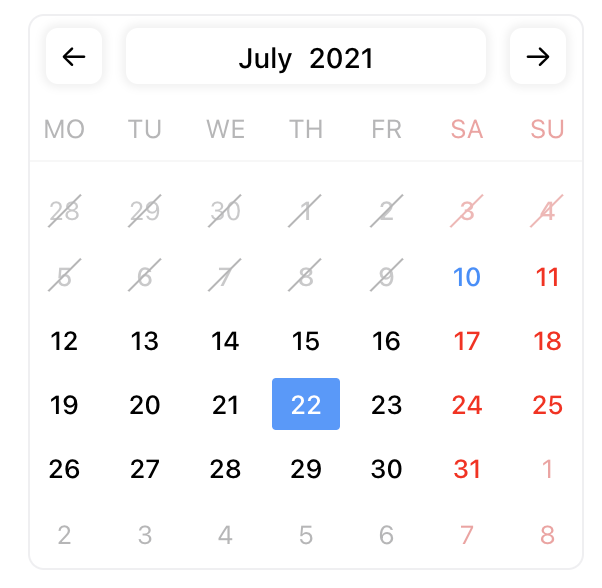
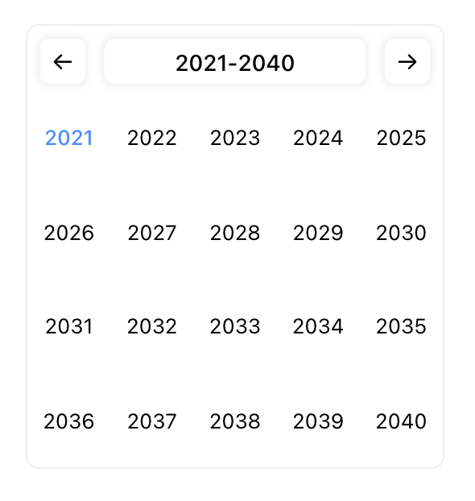
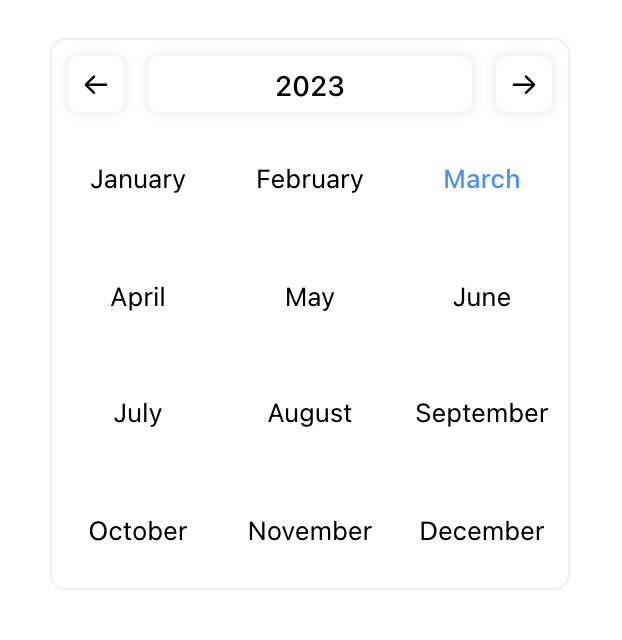

# Awesome React Calendar

This project is currentlly under active development. Use `yarn start` to test it.

## Links

https://uxplanet.org/how-to-design-a-perfect-date-picker-control-7f47d1290c3a
https://www.smashingmagazine.com/2017/07/designing-perfect-date-time-picker/
http://ui-patterns.com/patterns/CalendarPicker
https://uxdesign.cc/date-picker-design-5c5ef8f35286
https://material.angular.io/components/datepicker/overview

https://lokeshdhakar.com/dev-201-stripe.coms-main-navigation/
https://codepen.io/smpnjn/pen/VwKXdmy
https://codepen.io/ashfaqace/pen/RpyYdG

## Todos

- highlights
- max
- min
- custom class names
- shortcuts
- add simple validations

## Images

### Date Range view

### Days of month view

### Years view

### Months view

